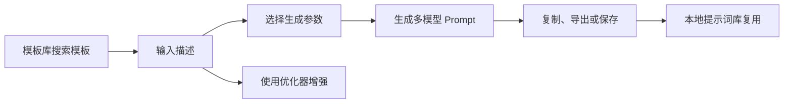

# TSC AI Prompt Studio PRD

## 1. 产品概述

TSC AI Prompt Studio 是一个可直接部署到 GitHub Pages 的单文件 AI 提示词工作台。用户输入创意描述后，可以生成适配通用图像模型、Midjourney、Flux、Video AI 和 SeaDance 2.0 的专业 Prompt，也可以使用优化器、模板库、质量评分、本地提示词库和导出能力完成提示词迭代。

当前阶段采用 0 成本策略：不接入付费 AI API、不建设后端、不使用数据库、不要求用户登录。所有用户输入、优化历史和本地提示词库都保存在浏览器本地。运行时唯一外部请求是 GitHub Star 数展示。

## 2. 目标用户

- AI 绘画和 AI 视频创作者
- 需要快速生成高质量 Prompt 的内容创作者
- 学习 Prompt Engineering 的初学者
- 需要 SEO、写作、营销、编程、学习类提示词模板的用户
- 后续可能转化为付费用户的高频创作者和团队用户

## 3. 核心价值

- 低门槛：中文或英文输入即可生成专业 Prompt。
- 多模型：一次生成多个模型可用结果，减少重复改写。
- 本地优先：不上传用户内容，降低隐私顾虑。
- 零成本部署：单文件、零依赖、可直接部署静态页面。
- 可积累：本地提示词库让用户沉淀可复用 Prompt。

## 4. 功能模块

### 4.1 Prompt 生成器

- 输入描述。
- 选择画面比例、艺术风格、画面质量、风格化强度。
- 输出 5 类 Prompt：Universal、Midjourney、Flux、Video AI、SeaDance 2.0。
- 每条结果支持复制、TXT 下载、Markdown 下载、保存到本地提示词库。

### 4.2 Prompt 优化器

- 输入简单描述。
- 自动增强为更具体的专业描述。
- 输出 ChatGPT、Midjourney、Flux、Video AI、SeaDance 2.0 版本。
- 展示原文和增强结果对比。
- 保存优化历史，支持回填和清空。

### 4.3 模板库

- 9 个分类：SEO、博客写作、YouTube 脚本、编程助手、学习助手、营销文案、Midjourney、Flux、SeaDance。
- 每个模板提供中英文版本。
- 支持全部、收藏和单分类浏览。
- 支持关键词搜索，搜索范围随当前视图变化。
- 自动识别模板中的 `[占位符]`，生成本地填写表单。
- 填写过程中提供实时预览，可复制结果或插入生成器。
- 模板支持本地收藏，收藏状态保存在浏览器。
- 模板支持复制分享链接，通过 URL hash 打开指定模板。

### 4.4 质量评分

- 评分维度：清晰度、上下文、具体性、结构性。
- 输出 0-100 分。
- 给出针对性的改进建议。

### 4.5 本地提示词库

- 从生成结果保存提示词。
- 展示模型、保存时间和 Prompt 内容。
- 支持复制、恢复到生成器、删除、清空。
- 支持 JSON 导出和导入。
- 最多保留 80 条，导入时去重并截断。

### 4.6 偏好和体验

- 中英文双语。
- 深色和浅色主题。
- 响应式布局。
- Tab 键可访问主要控件。
- Tab 导航支持左右方向键、Home、End。
- 支持 `prefers-reduced-motion`。

## 5. 页面结构

| 区域 | 功能 |
| --- | --- |
| 导航栏 | 品牌、GitHub Star、语言切换、主题切换 |
| Hero | 产品定位、能力标签、开始入口 |
| Tab 导航 | 生成器、优化器、模板库切换 |
| 生成器 | 描述输入和参数选择 |
| 生成结果 | 五类模型 Prompt 卡片 |
| 质量评分 | 分数、维度条、改进建议 |
| 本地提示词库 | 保存、恢复、复制、删除、导入导出 |
| 优化器 | 简单描述增强、多模型优化结果、历史 |
| 模板库 | 使用说明、搜索、分类、收藏、占位符填写、模板卡片 |
| Footer | GitHub、Issue、License |

## 6. 核心流程

## 7. 当前非目标

- 不接入真实 AI API。
- 不上传用户输入。
- 不做账号系统、云同步、团队空间。
- 不做付费入口和订阅管理。
- 不引入构建工具、前端框架或后端服务。
- 不新增 PWA、自定义模板、Diff View、多语言扩展等较大功能。

## 8. 后续商业化方向

当前功能优先验证用户需求和留存价值。后续有预算后可考虑：

- 账号和云同步。
- 团队协作空间。
- 高级模板市场。
- AI API 辅助改写和补全。
- Prompt 版本管理和 Diff。
- 付费订阅、额度、发票和隐私合规。
