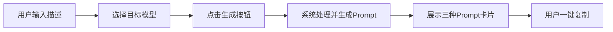

## 1. 产品概述

一个现代化 AI 提示词生成网站，用户输入简单中文描述后，自动生成适配不同 AI 绘画/视频模型的高质量 Prompt。采用 Apple 风格的深色科技感 UI，单文件部署，可直接发布到 GitHub Pages。

## 2. 核心功能

### 2.1 功能模块

1. **主页/输入区**：文本输入框、模型选择器、生成按钮、参数调节面板
2. **结果展示区**：三种 Prompt 卡片（Midjourney、Flux、视频），每个卡片含复制按钮

### 2.2 页面详情

| 页面名称 | 模块名称 | 功能描述 |
|---------|---------|---------|
| 主页 | 输入区 | 多行文本输入、模型切换标签、高级参数（风格、质量、比例）、生成按钮 |
| 主页 | 结果展示区 | 三列卡片布局，每列显示生成的 Prompt，支持一键复制，带高亮动画 |
| 主页 | 顶部导航 | 品牌 Logo、标题、深色背景毛玻璃效果 |

## 3. 核心流程

用户输入中文描述 → 选择目标模型 → 点击生成 → 系统生成三种格式的 Prompt → 展示在结果卡片中 → 用户点击复制按钮

## 4. 用户界面设计

### 4.1 设计风格

- **色彩体系**：深色背景（#0a0a0f 为主），蓝紫色渐变作为强调色（#6366f1 → #a855f7），文字采用白色/灰白层次
- **按钮风格**：圆角按钮，渐变背景，悬停时有发光效果和轻微缩放
- **字体**：SF Pro Display（苹果系统字体）或替代无衬线字体，标题使用较粗字重，正文使用常规字重
- **布局风格**：卡片式布局，大量留白，居中对称，毛玻璃效果面板
- **图标风格**：使用简约线条图标（Lucide Icons）

### 4.2 页面设计概览

| 页面名称 | 模块名称 | UI 元素 |
|---------|---------|---------|
| 主页 | 顶部导航 | 毛玻璃效果导航栏，品牌文字居中，背景半透明模糊 |
| 主页 | 输入区 | 圆角大输入框，底部标签选择器，发光生成按钮 |
| 主页 | 结果展示区 | 响应式三列卡片，深色半透明背景，复制图标按钮，生成时渐入动画 |

### 4.3 响应式设计

- 桌面端优先设计（≥1024px 三列布局）
- 平板端自适应（768px-1024px 两列布局）
- 移动端单列堆叠（<768px）
- 触摸优化：按钮最小 44px，输入框字体 16px 防缩放
