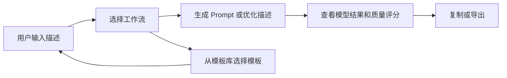

## 1. 产品概述

TSC AI Prompt Studio 是一个可直接部署到 GitHub Pages 的单文件 AI 提示词工作台。用户输入简单描述后，可以生成适配通用图像模型、Midjourney、Flux、视频 AI 和 SeaDance 2.0 的专业 Prompt，也可以使用优化器、模板库、质量评分和导出能力完成提示词迭代。

产品继续坚持无后端、零依赖、浏览器本地运行：用户输入不上传服务器，偏好和优化历史仅保存在 `localStorage`。

## 2. 核心功能

### 2.1 功能模块

1. **Prompt 生成器**：多行输入、艺术风格、画面比例、质量和风格化参数，生成 5 种模型 Prompt。
2. **Prompt 优化器**：将简单描述增强为专业描述，并输出 ChatGPT、Midjourney、Flux、视频 AI、SeaDance 2.0 优化版本。
3. **模板库**：提供 SEO、博客、YouTube、编程、学习、营销、Midjourney、Flux、SeaDance 9 类双语模板，一键填入生成器。
4. **质量评分**：从清晰度、上下文、具体性、结构性 4 个维度给出 0-100 分和改进建议。
5. **导出与复制**：生成结果支持复制、TXT 下载、Markdown 下载；优化结果支持复制。
6. **偏好与体验**：中英双语、深色/浅色主题、优化历史、本地偏好保存、响应式布局。

### 2.2 页面详情

| 页面区域 | 模块名称 | 功能描述 |
|---------|---------|---------|
| 顶部导航 | 品牌与操作 | Logo、GitHub Star、语言切换、主题切换 |
| Hero | 产品入口 | 产品定位、能力标签、开始使用与 GitHub 链接 |
| Tab 导航 | 工作区切换 | 生成器、优化器、模板库三种工作流 |
| 生成器 | 输入与参数 | 描述输入、比例、艺术风格、质量、风格化强度 |
| 生成结果 | Prompt 卡片 | 展示 5 种模型结果，支持复制/TXT/Markdown |
| 质量评分 | 评分面板 | 展示总分、4 项指标和优化建议 |
| 优化器 | 增强与历史 | 展示原始/增强对比、模型优化结果、历史记录 |
| 模板库 | 分类与模板 | 分类筛选、模板预览、一键使用 |

## 3. 核心流程

## 4. 用户界面设计

- **视觉风格**：深色科技感为默认主题，支持浅色主题；蓝紫渐变作为强调色，卡片和控件使用毛玻璃效果。
- **响应式布局**：桌面端多列展示，平板端自适应，移动端单列堆叠；交互控件保持至少 44px 触摸高度。
- **可访问性**：主要控件可键盘访问；Tab 导航应具备语义角色、当前状态和清晰焦点样式。
- **性能约束**：首屏不依赖大体积动图；背景动效应支持 reduced-motion，避免低性能设备卡顿。

## 5. 非目标

- 本阶段不接入真实 AI API，不上传用户输入。
- 不引入构建工具、框架或后端服务。
- 不实现 PWA、收藏夹、自定义模板、Diff View 或新增语言。
