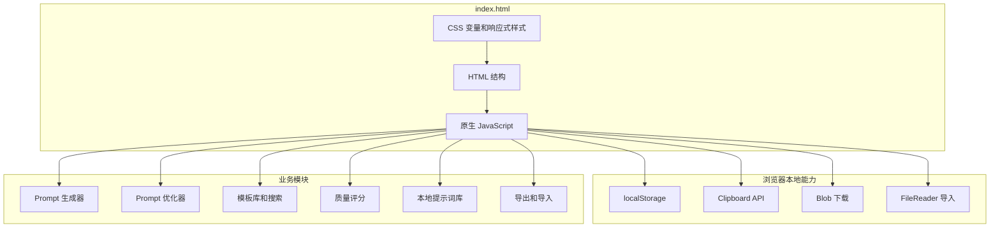

# TSC AI Prompt Studio 技术架构

## 1. 架构原则

- 单文件入口：`index.html` 是完整应用。
- 零依赖：不使用构建工具、包管理器、前端框架或后端服务。
- 本地优先：用户输入、偏好、优化历史和本地提示词库保存在浏览器本地。
- 安全渲染：所有用户可控内容进入 HTML 前必须转义。
- 可直接部署：支持 GitHub Pages 和任意静态托管平台。

## 2. 运行时结构



## 3. 模块边界

| 模块 | 职责 |
| --- | --- |
| `LOCALES` | 中文和英文 UI 文案、下拉选项、Toast 文案 |
| 状态常量 | 当前语言、当前主题、本地库 key、模板搜索词、最新生成结果 |
| 安全工具 | `escapeHTML`、`safeStorageGet`、`safeStorageSet`、`safeStorageRemove` |
| 生成器 | Universal、Midjourney、Flux、Video AI、SeaDance 2.0 Prompt 生成 |
| 优化器 | 描述增强、多模型优化、优化历史 |
| 模板库 | 分类数据、当前分类搜索、模板插入 |
| 质量评分 | 4 维度评分和建议生成 |
| 本地提示词库 | 保存、去重、复制、恢复、删除、清空、JSON 备份恢复 |
| UI 控制 | 语言切换、主题切换、Tab 切换、键盘导航、Toast |
| 导出工具 | Clipboard、TXT、Markdown、JSON |

## 4. 数据模型

### 4.1 PromptCard

```typescript
interface PromptCard {
  model: string;
  icon: string;
  iconClass: "universal" | "mj" | "flux" | "video" | "seedance";
  desc: string;
  prompt: string;
}
```

### 4.2 VaultItem

```typescript
interface VaultItem extends PromptCard {
  id: string;
  source: "generated" | string;
  createdAt: string;
}
```

### 4.3 OptimizeHistoryItem

```typescript
interface OptimizeHistoryItem {
  input: string;
  enhanced: string;
  time: string;
}
```

### 4.4 VaultBackup

```typescript
interface VaultBackup {
  app: "TSC AI Prompt Studio";
  version: 1;
  exportedAt: string;
  items: VaultItem[];
}
```

## 5. 存储策略

| Key | 内容 | 说明 |
| --- | --- | --- |
| `tsc-lang` | 当前语言 | `zh` 或 `en` |
| `tsc-theme` | 当前主题 | `dark` 或 `light` |
| `tsc-opt-history` | 优化历史 | 最多 20 条 |
| `tsc-prompt-vault` | 本地提示词库 | 最多 80 条 |

本地存储读写必须使用安全包装函数。读取失败时返回默认值，写入失败时静默降级，不阻断页面使用。

## 6. 安全策略

- 用户输入、模板内容、历史记录、导入 JSON、生成结果渲染前必须调用 `escapeHTML`。
- 导入 JSON 需要结构校验、字段归一化、ID 安全字符限制、去重和最大数量截断。
- 不执行导入文件中的任何脚本。
- 不向后端发送用户输入或保存的 Prompt。
- GitHub Star 请求只读取公开仓库元数据。

## 7. 可访问性策略

- Tab 导航使用 `role="tablist"`、`role="tab"`、`aria-selected`、`aria-controls`。
- Tab 支持方向键、Home、End 切换。
- 主要按钮、输入框、选择框和动态列表项必须有可见焦点态。
- 移动端控件最小高度保持接近 44px。
- reduced-motion 用户减少动画和 hover 位移。

## 8. 性能策略

- README 默认展示静态截图，不直接加载 45MB `assets/demo.gif`。
- 页面背景动效保持轻量，并支持 reduced-motion。
- 不引入字体、图标库或第三方脚本。
- 动态渲染只在用户操作或语言切换时发生。

## 9. 部署模型

项目无需构建。部署时只需要保证仓库根目录和静态资源可访问：

- `index.html`
- `assets/logo.svg`
- `assets/dark-theme.png`
- `assets/light-theme.png`
- `assets/demo.gif`

推荐平台：GitHub Pages、Cloudflare Pages、Netlify、Vercel、任意静态服务器。
