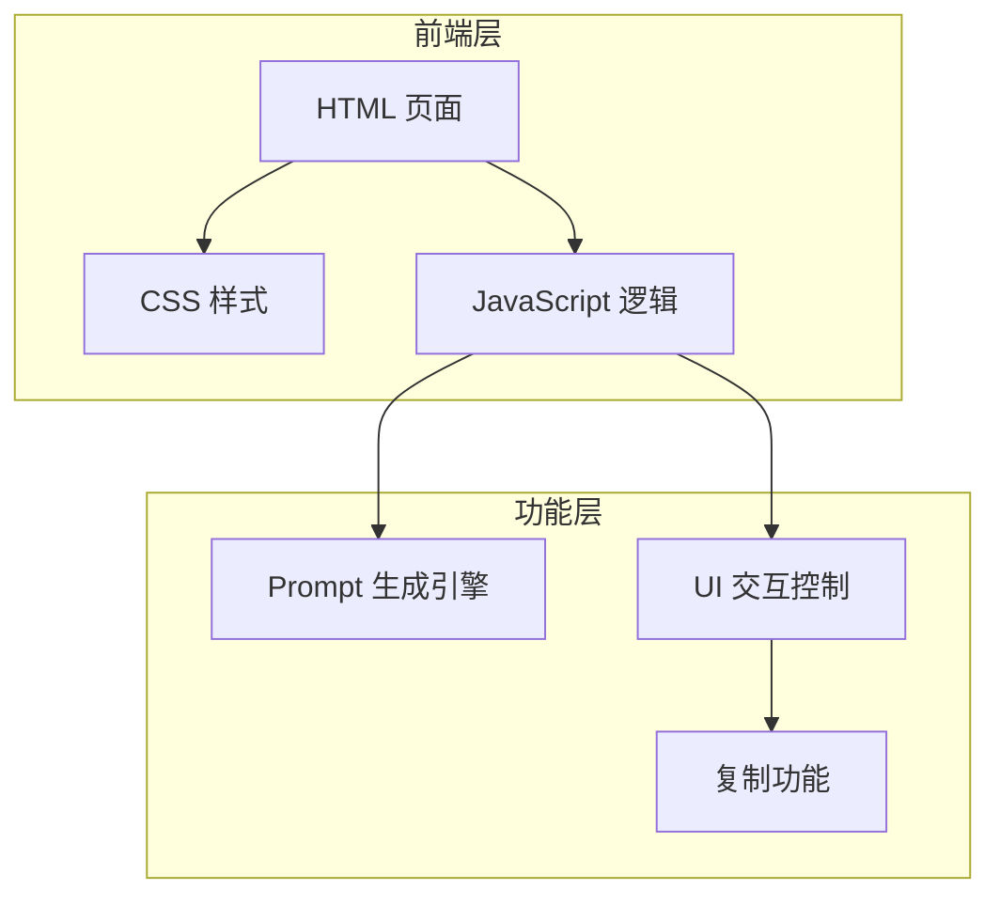

## 1. 架构设计



## 2. 技术说明

- **前端**：纯 HTML + CSS + JavaScript（单文件部署）
- **样式**：内联 CSS，使用 CSS 变量管理主题
- **交互**：原生 JavaScript ES6+，无框架依赖
- **部署**：单文件 HTML，可直接部署到 GitHub Pages
- **无后端**：所有 Prompt 生成逻辑在客户端完成

## 3. 路由定义

| 路由 | 用途 |
|------|------|
| / | 首页：输入区 + 结果展示区 |

## 4. Prompt 生成逻辑

### 4.1 Midjourney Prompt 模板

```
[用户描述] --v 6.0 --ar [比例] --q 2 --style raw --s [风格化程度]
附加参数：[风格修饰词]
```

### 4.2 Flux Prompt 模板

```
[用户描述], [风格描述], [质量描述], cinematic lighting, ultra detailed, 8k resolution
```

### 4.3 视频 Prompt 模板

```
[用户描述], smooth motion, cinematic camera movement, photorealistic, 4k video, dynamic lighting, film grain
```

### 4.4 风格映射表

| 中文风格 | Midjourney 风格参数 | Flux 风格描述 | 视频风格描述 |
|---------|-------------------|--------------|-------------|
| 写实 | --style photographic | photorealistic | photorealistic |
| 动漫 | --style anime | anime style, cel shading | anime style |
| 油画 | --style oil painting | oil painting style | oil painting texture |
| 赛博朋克 | --style cyberpunk | cyberpunk, neon lights | cyberpunk neon |
| 极简 | --style minimal | minimal design | minimalist aesthetic |
| 水彩 | --style watercolor | watercolor painting | watercolor animation |
| 科幻 | --style sci-fi | sci-fi futuristic | sci-fi cinematic |
| 奇幻 | --style fantasy | fantasy magical | fantasy cinematic |

## 5. 数据模型

### 5.1 输入数据结构

```typescript
interface UserInput {
  description: string;      // 用户描述
  model: string;            // 目标模型
  style: string;            // 风格选择
  aspectRatio: string;      // 画面比例
  quality: number;          // 质量等级 1-5
  stylize: number;          // 风格化程度 0-1000
}
```

### 5.2 输出数据结构

```typescript
interface PromptResult {
  midjourney: string;       // Midjourney 格式
  flux: string;             // Flux 格式
  video: string;            // 视频格式
}
```
