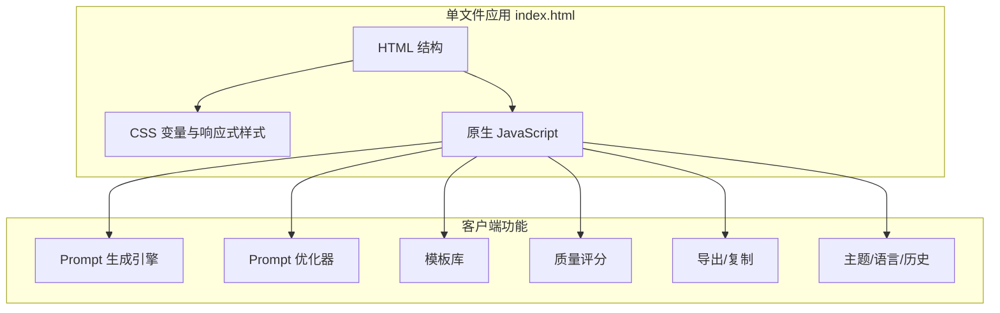

## 1. 架构设计



## 2. 技术说明

- **前端**：纯 HTML + CSS + JavaScript，入口文件为 `index.html`。
- **部署**：无构建步骤，可直接打开本地文件或部署到 GitHub Pages、Vercel、Netlify、Cloudflare Pages 等静态托管。
- **依赖**：运行时零依赖，无框架、无包管理器、无后端。
- **存储**：`localStorage` 保存语言、主题和优化历史。
- **网络访问**：页面运行时只请求 GitHub 仓库 Star 数；用户输入、Prompt 和历史记录不上传。
- **文档资产**：`assets/logo.svg`、`assets/dark-theme.png`、`assets/light-theme.png`、`assets/demo.gif` 为当前存在的静态资产。

## 3. 前端模块边界

| 模块 | 责任 |
|------|------|
| `LOCALES` | 中英文 UI 文案、下拉选项和提示文案 |
| 状态变量 | 当前语言、主题、模板分类 |
| 渲染工具 | 安全转义、动态卡片、评分面板、历史列表和模板列表渲染 |
| 生成引擎 | Universal、Midjourney、Flux、Video、SeaDance 2.0 Prompt 生成 |
| 优化引擎 | 描述增强、模型适配优化、优化历史保存 |
| UI 控制 | 主题切换、语言切换、Tab 切换、Toast、键盘快捷键 |
| 导出工具 | Clipboard、TXT 下载、Markdown 下载 |

## 4. 数据模型

### 4.1 用户输入

```typescript
interface UserInput {
  description: string;
  style: string;
  aspectRatio: string;
  quality: "1" | "2" | "3";
  stylize: string;
}
```

### 4.2 生成结果

```typescript
interface PromptCard {
  model: string;
  icon: string;
  iconClass: "universal" | "mj" | "flux" | "video" | "seedance";
  desc: string;
  prompt: string;
}
```

### 4.3 优化历史

```typescript
interface OptimizeHistoryItem {
  input: string;
  enhanced: string;
  time: string; // ISO string
}
```

## 5. 安全与可访问性约束

- 动态渲染用户输入、模板内容、历史记录和生成结果时必须使用安全转义或 DOM 文本节点，避免把用户可控内容直接拼进 HTML。
- Tab 导航使用 `role="tablist"`、`role="tab"`、`aria-selected` 和键盘左右方向键切换。
- 主题、语言和历史读取失败时应回退到默认值，不能阻断页面初始化。
- 动效应尊重 `prefers-reduced-motion: reduce`，减少动画和滚动行为。

## 6. Prompt 生成逻辑

- **Universal**：用户描述 + 通用风格描述 + 高质量构图描述。
- **Midjourney**：用户描述 + 质量词 + 风格词 + `--v 6.0 --ar [比例] --q 2 --style raw --s [风格化]`。
- **Flux**：用户描述 + Flux 风格词 + ultra detailed / professional quality 等质量词。
- **Video**：用户描述 + 视频风格词 + smooth motion / cinematic camera movement 等动态描述。
- **SeaDance 2.0**：用户描述 + 镜头类型、运镜、光照、氛围、物理运动和音频同步描述。
