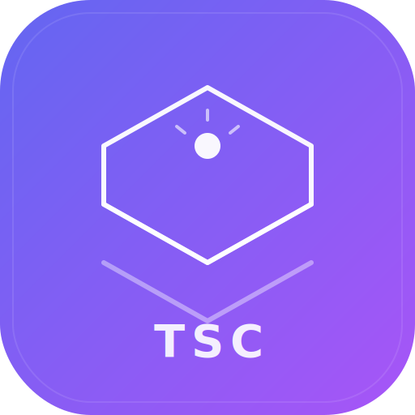
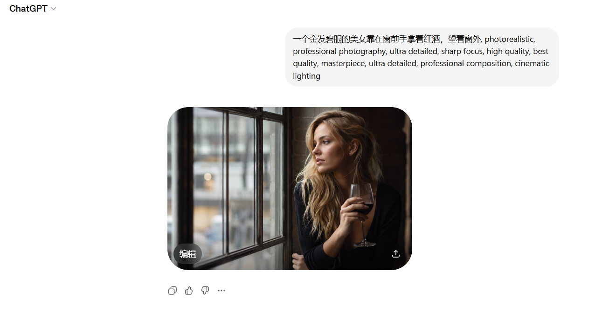
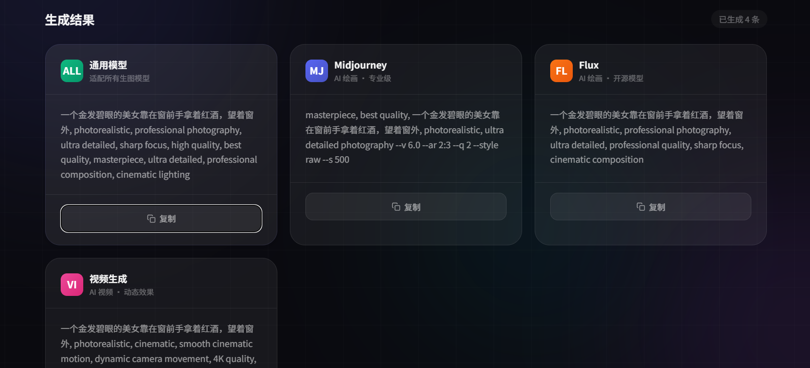

<div align="center">



# TSC AI Prompt Studio

**Modern AI Prompt Generator · Optimizer · Template Library · Local Prompt Vault**

Enter a creative idea and generate professional prompts for universal image models, Midjourney, Flux, Video AI, and SeaDance 2.0.

[Live Demo](https://pkokwho.github.io/tsc/) · [Report Bug](https://github.com/pkokwho/tsc/issues) · [Request Feature](https://github.com/pkokwho/tsc/issues/new?template=feature_request.md) · [中文](README.md)

[](LICENSE)
[](https://pkokwho.github.io/tsc/)
[](CONTRIBUTING.md)

</div>

## Demo

<p align="center">
  
  
</p>

<details>
<summary>View demo GIF (about 45MB)</summary>

<p align="center">
  
</p>

</details>

## Features

### Prompt Generator

- Generates prompts for Universal, Midjourney, Flux, Video AI, and SeaDance 2.0.
- Includes 12 art styles: photorealistic, cyberpunk, anime, oil painting, watercolor, sci-fi, and more.
- Supports aspect ratio, quality, and stylize controls.
- Each result can be copied, downloaded as TXT or Markdown, or saved to the local prompt vault.

### Prompt Optimizer

- Expands simple descriptions into more specific professional prompts.
- Produces optimized outputs for ChatGPT, Midjourney, Flux, Video AI, and SeaDance 2.0.
- Shows original vs enhanced text.
- Saves optimizer history locally for recall and clearing.

### Template Library

- 9 categories: SEO, Blog Writing, YouTube Script, Coding Assistant, Study Assistant, Marketing Copy, Midjourney, Flux, and SeaDance.
- Every template has Chinese and English versions.
- Search across all templates, one category, or favorite templates.
- Detects `[placeholders]` and generates a fill-in form with live preview.
- Templates can be saved locally as favorites for reuse.
- Template links can be copied and opened through URL hashes.

### Local Prompt Vault

- Save high-value prompts from generated results.
- Copy, restore, delete, or clear saved prompts.
- Export and import JSON backups for migration.
- All data stays in the browser. No account, backend, or database required.

### Quality Score

- Scores prompts by clarity, context, specificity, and structure.
- Shows a 0-100 score after generation.
- Provides targeted improvement suggestions.

## Zero-Cost Product Principles

The current phase intentionally avoids paid APIs, databases, login systems, cloud sync, and paid analytics. The project remains:

- Single entry file: `index.html`
- Zero dependency: no build tool, package manager, or runtime dependency
- Local-first: user input, optimizer history, and saved prompts stay in the browser
- Directly deployable: GitHub Pages, Cloudflare Pages, Netlify, Vercel, or any static server

The only runtime external request fetches the GitHub repository star count for social proof. User input and saved prompts are not uploaded.

## Quick Start

```bash
git clone https://github.com/pkokwho/tsc.git
cd tsc
```

Open `index.html` in a browser. No install step. No build step.

## Deployment

### GitHub Pages

1. Fork or push this repository to GitHub.
2. Go to **Settings > Pages**.
3. Set source to the `master` branch and root directory.
4. Visit `https://<username>.github.io/tsc/`.

### Other Static Platforms

`index.html` is a complete static application and can be deployed to:

- Cloudflare Pages
- Netlify
- Vercel
- Any static web server
- Local filesystem

## Tech Stack

- Vanilla HTML / CSS / JavaScript
- CSS custom properties for theming
- `localStorage` for language, theme, optimizer history, and local prompt vault
- Blob + FileReader for TXT, Markdown, and JSON export/import
- No framework, no build step, no backend

## Project Structure

```text
tsc/
├── .github/                         # Issue and PR templates
├── .trae/documents/                 # Product and architecture planning docs
├── assets/
│   ├── logo.svg                     # Logo
│   ├── dark-theme.png               # Dark theme screenshot
│   ├── light-theme.png              # Light theme screenshot
│   └── demo.gif                     # Demo GIF, folded by default in README
├── docs/superpowers/plans/          # Implementation plan records
├── index.html                       # Complete single-file app
├── README.md                        # Chinese documentation
├── README_EN.md                     # English documentation
├── CHANGELOG.md                     # Changelog
├── SECURITY.md                      # Security policy
├── SUPPORT.md                       # Support channels
├── CONTRIBUTING.md                  # Contribution guide
└── LICENSE                          # MIT License
```

## Roadmap

### Current Zero-Cost Phase

- [x] Multi-model prompt generation
- [x] Prompt optimizer
- [x] Template library
- [x] Quality scoring
- [x] Local prompt vault
- [x] JSON backup and restore
- [ ] Local custom templates
- [ ] Prompt version diff
- [ ] PWA offline cache

### Future Funded Phase

- [ ] Accounts and cloud sync
- [ ] Team workspaces
- [ ] Premium template marketplace
- [ ] Paid plans and subscriptions
- [ ] Real AI API-assisted generation
- [ ] Privacy compliance and product analytics

## Releases

| Version | Date | Description |
|---------|------|-------------|
| [v3.3.0] | 2026-06-14 | Template placeholder filling, favorites, global search, share links |
| [v3.2.0] | 2026-06-14 | Local prompt vault, JSON backup/restore, template search, doc encoding fix |
| [v3.1.1] | 2026-06-13 | Stability polish, docs sync, safe rendering, accessibility improvements |
| [v3.1.0] | 2026-06-05 | SeaDance 2.0 support |
| [v3.0.0] | 2026-06-05 | Template Library, Quality Score, Export features |
| [v2.0.0] | 2026-06-03 | Bilingual system, theme toggle, SEO, open source standards |
| [v1.0.0] | 2026-06-03 | Initial release |

See [CHANGELOG.md](CHANGELOG.md) for details.

## Contributing

Contributions are welcome. Please read the [Contributing Guide](CONTRIBUTING.md).

## Code of Conduct

This project uses the [Contributor Covenant](CODE_OF_CONDUCT.md) as its code of conduct.

## License

[MIT](LICENSE) © TSC AI Prompt Studio
